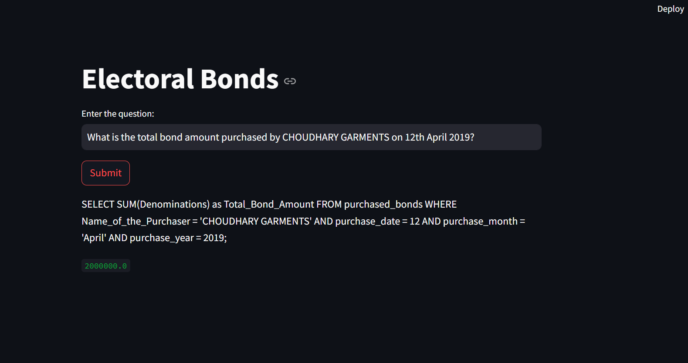
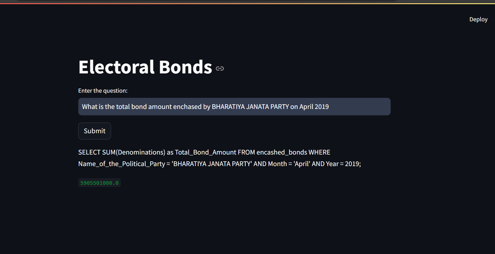

# Summer School Hackathon

## Objective

Communicate with a huge PDF that contains tables by extracting the data, processing it, and creating an UI to interact with the database.

## Intuition Behind the Solution

All the pages in the PDF contain the same structure. By extracting the data and converting it into a CSV file, we can preprocess and feature-extract using Pandas. This CSV file can then be converted into a MySQL database. By prompting GPT with table column information and a user query, we can generate SQL queries and execute them against the database using SQLAlchemy. Finally, an API will be built with Streamlit.

## how I define relation between two tables

there are no duplicate values for Prefix + Bond_No. so merging this column and making unique id column

for Purchase table ==> primary key -> Prefix + Bond_No.
for encashed table ==> foreign key reference from Purchase table(Prefix + Bond_No.)

--> problem here is there are some rows which are in encashed table but not in purchase table -> deleting this rows -> some information loss but it's working.
--> handling this with defining separate api call for query only related to encashed table --> this way it works

## Steps to Extract PDF and Add Features

1. **Remove Rows with Column Headers:**
   - Extract the data from the PDF and remove all rows that contain column headers for each page.
2. **Create New Columns:**
   - Separate the previous date column into new columns: date, month, and year.
3. **Remove Unnecessary Columns:**
   - Remove all columns that are not required for the analysis.
4. **Save to CSV and Convert to MySQL Database:**
   - Save the cleaned data to a CSV file and convert it into a MySQL database.

## Using Aiven: Hosted MySQL Database

Aiven provides a hosted MySQL database that makes database operations smoother and easier to manage in the cloud.

## Project Workflow

1. **PDF Extraction:**
   - Extract data from the PDF and preprocess it.
2. **Data Cleaning and Feature Extraction:**
   - Clean the data and extract relevant features using Pandas.
3. **Database Conversion:**
   - Save the cleaned data to a CSV file and load it into a MySQL database.
4. **API Development:**
   - Build an API using Streamlit to interact with the MySQL database.
5. **Query Generation:**
   - Use GPT to generate SQL queries from user prompts based on table column information.
6. **Database Interaction:**
   - Execute generated SQL queries against the MySQL database using SQLAlchemy.

## Technologies Used

- **tebula:** For Extract tables from the pdf
- **Pandas:** For data preprocessing and feature extraction.
- **SQLAlchemy:** For ORM and database interactions.
- **Streamlit:** For building the API.
- **Aiven:** For hosted MySQL database.
- **GPT:** For generating SQL queries from user prompts.

## How to Run the Project

1. **Set Up Environment:**
   - Install required packages: `pandas`, `tebula`,`sqlalchemy`, `streamlit`, `openai`.
   - Set up the MySQL database on Aiven.
2. **Extract and Preprocess Data:**
   - Run the script to extract and preprocess data from the PDF.
3. **Convert CSV to MySQL:**
   - Load the cleaned data into the MySQL database.
4. **Build and Run the API:**
   - Develop the Streamlit UI/API and run it to interact with the database.

## Future Improvements

- Automate the extraction and preprocessing steps.
- Enhance the API with more advanced querying capabilities.
- Improve the prompt generation for GPT to handle more complex queries.

## Thanks to MAN PATEL, DHARMIK VALANI

